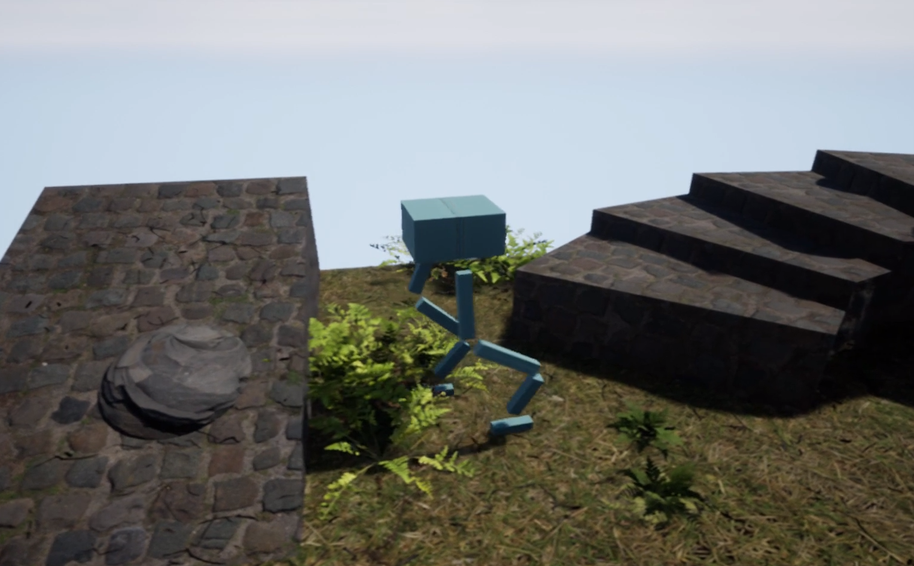

# Learning Animation In UE4

Create a simple two-legged robot and keyframe walking, turning and jumping animation clip. Write animation blueprint, state machine for animation transition, IK and body compress. Add dynamics effect with physics asset.

Watch on Vimeo:
[Robot Animation](https://vimeo.com/408257269)
